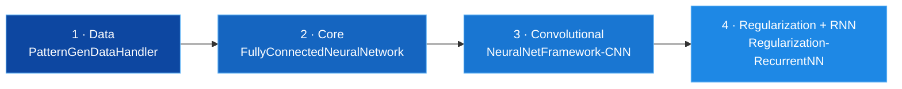

<h1 align="center">Hussein Said</h1>

  Machine learning for signals and sensors EEG, EMG, and multispectral imaging. 
  I build the whole path: raw sensor data → preprocessing → features → model → real-time inference.

  
  
  
  
  
  
  

---

## What I work on

Most of my work sits where **physical sensors meet machine learning**  the messy part, where signals
are noisy, misaligned, and there is never enough labelled data.

Two threads run through it:

**Signals from the body.** Predicting continuous finger force from EEG and EMG recorded
simultaneously aligning three streams at different sampling rates, removing artifacts, extracting
spectral features, and getting a model to run fast enough for real-time inference over a live stream.

**Signals from materials.** Classifying plastic types from near-infrared multispectral imaging, where
polymers that look identical in visible light separate cleanly across nine wavelengths. Comparing deep
learning against gradient boosting on the same problem.

Underneath both: I learned the fundamentals by **building a neural network framework from scratch in
NumPy**  every layer, every backward pass, no autograd.

---

## Research projects

<table>
  <tr>
    <td width="50%" valign="top">
      <h3><a href="https://github.com/husseinsaeid85-hue/eeg-force-prediction">EEG + EMG → Force Prediction</a></h3>
      
<em>Research internship</em>

      
Continuous finger force regression from 31-channel EEG and 40-channel high-density EMG.
      Trial-wise alignment via MNE, current source density and ICA artifact removal, multitaper band
      power features, and Optuna-tuned XGBoost and LSTM models — plus a real-time inference path over
      Lab Streaming Layer.

      

        
        
        
        
      

    </td>
    <td width="50%" valign="top">
      <h3><a href="https://github.com/husseinsaeid85-hue/multispectral-plastic-classification">Multispectral Plastic Classification</a></h3>
      
<em>Master's thesis</em>

      
Classifying 11 polymer types from near-infrared imaging at 9 wavelengths (800–1350 nm).
      A ResNet-18 with its first convolution rebuilt for 9-channel input, benchmarked against XGBoost
      on spectral intensity features across seven hyperparameter search strategies.

      

        
        
        
        
      

    </td>
  </tr>
</table>

---

## Deep learning framework, from scratch

Four repositories, built in sequence a complete neural network framework in pure NumPy with no
autograd, no PyTorch, and every gradient derived and implemented by hand.

| # | Repository | What it adds |
|---|---|---|
| 1 | [PatternGenDataHandler](https://github.com/husseinsaeid85-hue/PatternGenDataHandler) | Pattern generation and an augmenting image batch loader |
| 2 | [FullyConnectedNeuralNetwork](https://github.com/husseinsaeid85-hue/FullyConnectedNeuralNetwork) | Fully connected layers, ReLU, SoftMax, cross-entropy, SGD |
| 3 | [NeuralNetFramework-CNN](https://github.com/husseinsaeid85-hue/NeuralNetFramework-CNN) | Conv 1D/2D, pooling, flatten, Xavier/He init, Adam and momentum |
| 4 | [Regularization-RecurrentNN](https://github.com/husseinsaeid85-hue/Regularization-RecurrentNN) | L1/L2 regularization, dropout, batch norm, RNN |

---

## Toolbox

| | |
|---|---|
| **Languages** | Python |
| **Deep learning** | PyTorch, torchvision, transfer learning, CNNs, LSTMs, RNNs |
| **Classical ML** | scikit-learn, XGBoost, PCA, cross-validation |
| **Tuning** | Optuna, Bayesian optimization, grid and randomized search |
| **Signals** | MNE, ICA, current source density, multitaper spectral estimation, Savitzky–Golay filtering |
| **Data** | NumPy, pandas, matplotlib, seaborn |
| **Infrastructure** | HPC clusters (SLURM), Lab Streaming Layer, uv, git |

---

  
  

